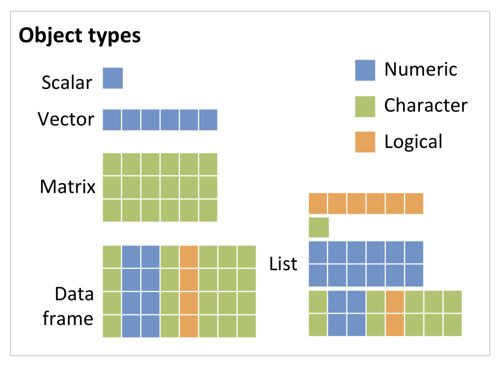

```{r setup, include=FALSE}
knitr::opts_chunk$set(echo = TRUE)
```

```{css style settings, echo = FALSE}
blockquote {
    padding: 10px 20px;
    margin: 0 0 20px;
    font-size: 16px;
    border-left: 5px solid #eee;
}
```

\newpage


# <font face="Marker Felt">*Previously on R Workshops*</font> : topics covered in the last section
In Session 1 - Getting Up and Running with R, we...:

* ... installed R Studio and got acquainted with it. 
* ... used basic commands and created an object.
* ... got to know some of R's build in data sets.
* ... learned how to create and save an R script.
* ... set a working directory.
* ... imported our own data set.
* ... learned about best practices. 

If many of these learning outcomes sound unfamiliar to you, especially if you have not installed RStudio yet, you may want to consider doing R Workshop 1 before today's workshop.


# Learning outcomes

__Today you will learn about:__

* datatypes
  + which data types exist?
  + how do you examine data with respect to data types?
  + how do you convert data types and how to do data type coercion.
* data structures:
  + vectors & lists
  + matrices & data frames
  + indexing of data structures
  + restructuring of data structures
  + data structure exploration
* factors.
* naming conventions.


__After today's lesson you should:__

* Define the characteristics of the data types and structures that exist and be able to identify the data type of an object.
* Be able to convert/coerce data types and know the hierarchy of coercion.
* Know how to name your R objects.
* Be able to explore R objects/data structures. 
* Be able to construct different data structures and retrieve elements from them. 
* Know how to restructure your data.

__*Let the fun begin!*__

# Set up

After you __open RStudio__, in the console, __set your working directory__.
There, you can either navigate to “Session” __&#8594;__ “Set Working Directory” __&#8594;__ “Choose Directory…” and navigate to the directory. Alternatively you can set your working directory using the function “setwd” as shown below in your console. 
As a *reminder*, the console is the lower left pane in RStudio.

> *Ideally you created a workshop folder with subfolders for each session in the last training session. In that case, create a new subfolder for session 2.*

```{r setup2, echo=TRUE, eval = FALSE}
setwd("C:/Users/YourUserName/OneDrive -University of Exeter/YourFolder")
```

Your working directory is now the folder you created. 

There, navigate to "File" __&#8594;__  "New File" __&#8594;__  "RScript". You can save all the Tasks in that file you created.


# Dataset

Read or load in the data for this session. We will be using the built-in R data sets called “iris” & "mtcars". 
As a *reminder*, with ```data()```, we can load data sets that are built-in R (you automatically installed them when you installed R).

```{r data, echo=TRUE, eval=FALSE}
data(iris)
data(mtcars)
```

#### Task 1 {-}
>1.) Explore which other data sets are available by typing ```data()``` and running that line of code in your console. 


------

--------

# Topics
## Intro to Data Types and Structures
### Data Types - *The basis of it all*

*Data types*, or modes, define how the values are stored in the computer. 
For your computer (and for R), there are __*3 core data types*:__

* Numeric
* Character
* Logical

Elements of these data types may be combined to form data structures, such as atomic vectors. When we call a vector *atomic*, we mean that the vector only holds data of a single data type. More detail in the next section "Data Structures".


#### Numeric {.unnumbered} 
\
The __numeric__ data type consists of numbers.

Those can be:

* __integers:__ ```1,-3,22,0,1890, 2L``` (The L explicitely tells R that this is an integer)
* __doubles:__ ```15.5, 0.01, -0.0004```

Additionally, you can have __complex__ numbers:

* __complex:__ ```1+4i``` (complex numbers with real and imaginary parts) ^[Interestingly, internally, complex numbers are stored as a pair of doubles. That means R knows that this is a complex number, to your computer, however, it is just a set of doubles.] 


#### Characters {.unnumbered} 
\
The __character__ data type consists of letters or words such as "a", "f", "datatypes", "Learning R is fun".

* __character__: ```Superkalifragilistikexpialegetisch, abc, @%£$```

Importantly, also __*numbers can be characters*__. To coerce numbers into characters, you can use ```""```. The distinction between a character representation of a number and a numeric one is important. For example:

```{r, echo=TRUE, eval=TRUE}
x=3
y=1.5
```

We can subtract them from each other:

```{r, echo=TRUE, eval=TRUE}
x-y
```

However, if we do this with the character representations of the numbers 3 and 1.5, the following happens:

```{r, echo=TRUE, eval=TRUE, error=TRUE}
x="3"
y="1.5"
x-y
```


#### Logical{.unnumbered} 
\

__Logical__ values can either be ```TRUE``` or ```FALSE```. ```TRUE```can also be represented as ```1``` and ```FALSE``` as ```0```. 
That means that if you type :

```{r, echo=TRUE, eval=TRUE, error=TRUE}
x=as.logical(c(1,0,0,1))
```

and use the function ```typeof()``` which returns the datatype of an object, it will return the type 'logical':

```{r echo=TRUE, error=TRUE}
typeof(x)
```

#### Task 2 & 3 <br> {-}
>2.) Find out, using RStudio Help in the menu or ```help('as.logical')``` in the console, what the command ```as.logical()``` does. \
3.) If you do not use ```as.logical()``` around ```c(1,0,0,1)``` (*i.e.* ```x=c(1,0,0,1)```), what does ```typeof(x)``` return and why [make a prediction first, then try out]?<br>


----

### Examining datatypes: *What and how are you?* 

R provides many functions to examine features of objects. Some are listed here:

* ```typeof()``` - what is the object’s data type (on the data storage level ("what the computer sees"))?
* ```class()``` - what is the object's data type (on the abstract type level("what R sees"))?
* ```mode()``` - what is the object's data type (on the data storage level ("what the computer sees"))?
* ```length()```- how long is it? 
* ```attributes()``` - does it have any metadata? 
* ```str``` - display the internal structure of an object.
* ```is.numeric()```, ```is.character()```, ```is.complex()```, ```is.logical()``` - returns TRUE when an object is the datatype queried, FALSE if not

__Some Examples:__
```{r, echo=TRUE, eval=TRUE, error=TRUE}
x <- "dataset"
typeof(x)
```

```{r, echo=TRUE, eval=TRUE, error=TRUE}
attributes(x)
```

```{r, echo=TRUE, eval=TRUE, error=TRUE}
y <- 1:10
y
```
```{r, echo=TRUE, eval=TRUE, error=TRUE}
typeof(y)
```

```{r, echo=TRUE, eval=TRUE, error=TRUE}
length(y)
```
<br>
<br>

#### Task 4 & 5 <br>{-}
>4.) Create the following objects:<br>```x=8```<br>``` y=8.9```<br> Use both ```typeof()``` and ```mode()``` to determine the datatypes of ```x``` and ```y```. What differences do you observe? \
5.) When you use ```class()``` on the ```iris``` dataset (*e.g.* ```class(iris)```) and when you use ```typeof()``` on the iris data set, which results do you get? The resulting data types/structures will be explained later in detail; keep the results in mind for [4.1.4.3](#4.1.4.3 Lists) and [4.1.4.4.](#4.1.4.4) <br>


-----


<center>
<font size="4">

$~$

__*Before we look at data structures, we need to look at naming conventions*__

$~$

</font size="4">
</center>

### Naming R objects

You can use any combination of alphanumeric characters, along with dots and underscores, to name an R object. But there are a few ___exceptions:___

* Names cannot start with a number;
* Names cannot have spaces;
* Names cannot be a standalone number such as ```12``` or ```0.34```;
* Names cannot be a reserved word such as ```if```, ```else```, ```function```, ```TRUE```, ```FALSE``` and ```NULL``` just to name a few (to see the full list of reserved words, type ```?Reserved```).

Examples of __*valid names*__ include ```a```, ```dat2```, ```cpi_index```, ```.tmp```, and even a standalone dot ```.``` (though a dot can make reading code difficult under certain circumstances).

Examples of __*invalid names*__ include ```1dat```,``` dat 2``` (note the space between ```dat``` and ```2```), ```df-ver2``` (the dash is treated as a mathematical operator), and ```Inf``` (the latter is a reserved word listed in the ```?Reserved``` help document).

You can mix cases, but use upper cases with caution since some letters look very much the same in both lower and upper cases (e.g. s and S).

#### Task 6<br>{-}
>6.) Check out ```?Reserved``` and take a look at the reserved words!

### Data Structures  

R has many __data structures__. These include:

* vectors:
  * atomic vector
  * list
* matrix
* data frame
* factors

A vector is the most common and basic data structure in R. Technically, __vectors can be one of two types__:

* atomic vectors
* lists

The term “vector” most commonly refers to the atomic types not to lists.

When we call a vector __atomic__, we mean that the vector only holds elements (or atoms) of a single data type and each atom is a scalar, which means it “has length one”. It is __*homogenous*__.
A __list__ is still vector, but it can be __*heterogenous*__, that means: lists can contain several datatypes and each atom of the list can itself be composed of more than one atom (has a length > one). 

#### Atomic vectors {.unnumbered} 
\
Let's first take a look at atomic vectors:

```{r, echo=TRUE, eval=TRUE, error=TRUE}
v_log <- c(TRUE, FALSE, FALSE, TRUE)
v_log
```

```{r, echo=TRUE, eval=TRUE, error=TRUE}
(v_int <- 1:4)
```
```{r, echo=TRUE, eval=TRUE, error=TRUE}
(v_doub <- 1:4 * 1.2)
```
```{r, echo=TRUE, eval=TRUE, error=TRUE}
(v_char <- letters[1:4])
```
<br>

#### Task 6 & 8<br>{-}
>7.)What do ```is.numeric()```, ```is.integer()```, and ```is.double()``` return for the vectors that hold floating point number versus integers? \
8.)What does ```letters()``` do?

-----

The concatenate or combine ```c()``` function will explicitly __construct__ a vector. We used it above to construct the logical vector. All the other vectors came about through other means, as in everyday coding, most vectors aren’t made explicitly with ```c()```. They tend to be created with some generator, like the ```1:n``` shortcut, or via transformation of an existing object.
The function ```c()``` can also be used to __add elements__ to a vector.

```{r, echo=TRUE, eval=TRUE, error=TRUE}
v_name <- c("Sarah", "Tracy", "Jon")
v_name <- c(v_name, "Annette")
v_name
```

```{r, echo=TRUE, eval=TRUE, error=TRUE}
v_name<- c("Greg", v_name)
v_name
```

-----

To __index a vector__  means to address specific atoms of that vector. To index a vector square brackets are used, like so: ```x[something]```. 
There are several ways to express which elements you want, i.e. there are several valid forms for ```something```.

##### Atomic vector indexing examples:{.unlisted .unnumbered} 

__Integer vector, all positive__: the elements specified in something are kept
```{r, echo=TRUE, eval=TRUE, error=TRUE}
v_char[2]
```
  We get the second element doing that. You can also use index ranges:
```{r, echo=TRUE, eval=TRUE, error=TRUE}
v_doub[2:3]
```

__Logical vector__: keep elements of x for which something is TRUE and drop those for which it is FALSE
```{r, echo=TRUE, eval=TRUE, error=TRUE}
v_char[c(FALSE, FALSE, TRUE, TRUE)]
```
  We can see that only elements remain, that were indexed with TRUE. We can also see that we can index a vector with a vector. That's also the case below:
```{r, echo=TRUE, eval=TRUE, error=TRUE}
v_char[v_log]
```

__Negative integers, all negative:__ the elements specified in something are dropped
```{r, echo=TRUE, eval=TRUE, error=TRUE}
v_char[-4]
```


#### Task 9, 10 & 11 {-}
>9.) What happens when you request the zero-th element of one of our vectors? \
10.) What happens when you ask for an element that is past the end of the vector, i.e. request x[k] when the length of x is less than k? \
11.)We indexed x with a logical vector of the same length. What happens if the indexing vector is shorter than x?<br>

Complete the Tasks and you’ll see it’s possible to get an atomic vector of length zero and also to get elements that are NA. In R, missing data is represented as __NA (Not Available)__. NA is a special value and a reserved variable, so you cannot use it in naming objects.   

Another neat thing is that if you request an element that is not there the underlying variable type is retained.

__Index of 0:__
```{r, echo=TRUE, eval=TRUE, error=TRUE}
v_int[0]
```

```{r, echo=TRUE, eval=TRUE, error=TRUE}
typeof(v_int[0])
```

__Outside bounds of the vector:__
```{r, echo=TRUE, eval=TRUE, error=TRUE}
v_doub[100]
```

```{r, echo=TRUE, eval=TRUE, error=TRUE}
typeof(v_doub[100])
```

__*So, why does a 0-indexed vector not return NA?*__
The answer is in the manual:

>NA and zero values are allowed: rows of an index matrix containing a zero are ignored, whereas rows containing an NA produce an NA in the result.

So an index of 0 just gets ignored. We can see this in the following

```{r, echo=TRUE, eval=TRUE, error=TRUE}
x <- 1:10
x[c(1, 3, 0, 5, 0)]
```
So if the only index we give it is 0 then the appropriate response is to return an empty vector.

-----

#### Data type coercion {.unnumbered} 
\
Even though R’s vectors have a specific data type, it’s quite easy to convert them to another type. This is called __coercion__. 
There’s a hierarchy of types: the more primitive ones cheerfully and silently (__implicitly__) convert to those higher up in the food chain. Here’s the order:

>__R coercion rules:__<br><br>
logical __&#8594;__ integer __&#8594;__ numeric __&#8594;__ complex __&#8594;__ character<br>

where __&#8594;__ can be read as “are transformed into”. Conversely, character is higher in the hierarchy than complex and that is higher in the hierarchy than numeric *etc.*.

For __explicit coercion__, use the ```as.*()``` functions.

```{r, echo=TRUE, eval=TRUE, error=TRUE}
v_log
as.integer(v_log)
v_int
as.numeric(v_int)
v_doub
as.character(v_doub)
as.character(as.numeric(as.integer(v_log)))
```

But coercion can also be triggered by other actions, such as assigning a scalar of the wrong type into an existing vector.

```{r, echo=TRUE, eval=TRUE, error=TRUE}
v_doub_copy <- v_doub
str(v_doub_copy)
v_doub_copy[3] <- "uhoh"
str(v_doub_copy)
```

Our numeric vector was silently coerced to character. This can be a wonderful source of bugs, so when debugging, always give serious thought to this question: Is this object of the type I think it is? How sure am I about that?

We end the discussion of atomic vectors with two specific examples of “being intentional about type”.

* Use of type-specific NAs when doing setup.
* Use of L to explicitly request integer. 


```{r, echo=TRUE, eval=TRUE, error=TRUE}
(big_plans <- rep(NA_integer_, 4))
str(big_plans)
big_plans[3] <- 5L
## note that big_plans is still integer!
str(big_plans)
## note that omitting L results in coercion of big_plans to double
big_plans[1] <- 10
str(big_plans)

```


#### Task 12<br>{-}
>12.) Recall the hieararchy of the most common atomic vector types: logical < integer < numeric < character. Try to use the ```as.*()``` functions to go the wrong way. Call ```as.logical()```, ```as.integer()```, and ```as.numeric()``` on a character vector, such as letters. What happens?

----

#### <a id="Lists"></a> Lists {.unnumbered}
\
Atomic vectors are very constrained: atoms are of a scalar/length 1 and need to be one data type. You might find yourself needing a vector that violates these constraints and for which the following is true:

* Individual atoms might have length greater than 1.
* Individual atoms might not be of the same flavor.

This is a when you need a __list__.

A list is actually still a vector in R, but it’s not an atomic vector. Lists are sometimes called __generic vectors__, because the elements of a list can be of any type of R object, even lists containing further lists. They are ultimately nice R containers for data. 

We __construct__ a list explicitly with ```list()``` but, like atomic vectors, most lists are created some other way in real life.

```{r, echo=TRUE, eval=TRUE, error=TRUE}
(x <- list(1:3, c("four", "five")))

(y <- list(logical = TRUE, integer = 4L, double = 4 * 1.2, character = "character"))

(z <- list(letters[26:22], transcendental = c(pi, exp(1)), f = function(x) x^2))

```
We have explicit proof above that list components can

* Be heterogeneous, i.e. can be of different “flavors”. 
* Have different lengths.
* Have names. Or not. Or some of both.

You can also __coerce__ other objects using ```as.list()```. 

To create an empty list of the required length in R, use the ```vector()``` function. ```list()``` does not allow you to create an empty list of a *specific length* (it just creates an empty list object). The ```vector()``` function takes two arguments: mode and length. In our case, the mode is a list, length is the number of elements in the list, and actually the list ends up being empty, filled with NULL.

```{r, echo=TRUE, eval=TRUE, error=TRUE}
a_list <- vector(mode="list", length = 5) # empty list
length(a_list)
a_list
```
The content of elements of a list can be retrieved by using double square brackets (more on that below).
```{r, echo=TRUE, eval=TRUE, error=TRUE}
a_list[[1]]
```

Vectors can be coerced to lists as follows:
```{r, echo=TRUE, eval=TRUE, error=TRUE}
other_list <- 1:10
other_list<- as.list(other_list)
length(other_list)
```

#### Task 13 & 14<br>{-}
>13.) What is the class of other_list[1]? \
14.) What is the class of other_list[[1]]?

----

##### List indexing {-}
\
List indexing is a bit more complicated than that of atomic vectors. There are __3 ways to index a list__ and the differences are very important:

1.) __With single square brackets__, i.e. just like we indexed atomic vectors. Note this always returns a list, even if we request a single component.

```{r, echo=TRUE, eval=TRUE, error=TRUE}
x[c(FALSE, TRUE)]
y[2:3]
z["transcendental"]

```

2.) __With double square brackets__. This can only be used to access a single component and it returns the “naked” component. You can request a component with a positive integer or by name.

```{r, echo=TRUE, eval=TRUE, error=TRUE}
x[[2]]

y[["double"]]
```

3.) ___With the ```$``` addressing named components__, which we will learn a lot more about when we look at data frames. Like ```[[```, this can only be used to access a single component, but it is even more limited: You must specify the component by name.

```{r, echo=TRUE, eval=TRUE, error=TRUE}
z$transcendental
```

A very good and easy-to-grasp example of the difference between the list-preserving indexing provided by ```[``` and the behaviour of ```[[``` is given here: [the pepper shaker analogy on R for Data Science](https://r4ds.had.co.nz/vectors.html#lists-of-condiments). Click the hyperlink to see more!

#### Task 15<br> {-}
>15.) Consider<br> ```my_vec <- c(a = 1, b = 2, c = 3)```\
```my_list <- list(a = 1, b = 2, c = 3)``` \
Use [ and [[ to attempt to retrieve elements 2 and 3 from my_vec and my_list. What succeeds vs. fails? What if you try to retrieve element 2 alone? Does [[ even work on atomic vectors? Compare and contrast the results from the various combinations of indexing method and input object.

-----

#### <a id="4.1.4.4"></a>Overview data frames & matrices{.unnumbered}
\
A __data frame__ & __matrices__ are very important data types in R. They are pretty much the de facto data structures for most tabular data and what we use for statistics.

While the data frame is a special type of list where every element of the list has same length (i.e. data frame is a “rectangular” list), the matrix is a special type of atomic vector.

The table below illustrates how they relate to each other:

__Table 1__

| Dimensions |	Homogeneous | Heterogeneous |
|:-----------|:-----------:|:-------------:|
| 1-D	| atomic vector |	list |
| 2-D |	matrix |	data frame |

------

#### Matrices{.unnumbered}
\
As Table 1 already hints, __matrices are atomic vectors with dimensions; the number of rows and columns__. As with atomic vectors, the elements of a matrix must be of the same data type.

To __create an empty matrix__, we need to define those dimensions:

```{r, echo=TRUE, eval=TRUE, error=TRUE}
m<-matrix(nrow=2, ncol=2)
m
```

We can __find out how many dimensions a matrix has__ by using ```dim()```
```{r, echo=TRUE, eval=TRUE, error=TRUE}
dim(m)
```

You can check that matrices are vectors with a class attribute of matrix by using ```class()``` and ```typeof()```.

```{r, echo=TRUE, eval=TRUE, error=TRUE}
m <- matrix(c(1:3))
class(m)
typeof(m)
```
While ```class()``` shows that ```m``` is a matrix, ```typeof()``` shows that in this case __*fundamentally the matrix is an integer vector*__ (we will see later that they are not always __integer__ vectors, but can be __character__ vectors, too.

When creating a __matrix__, it is important to remember that matrices __*are filled column-wise*__

```{r, echo=TRUE, eval=TRUE, error=TRUE}
m<-matrix(1:6, nrow=2, ncol=3)
m
```
If that is not what you want, you can use the ```byrow``` argument (a logical: can be ```TRUE``` or ```FALSE```) to specify how the matrix is filled
```{r, echo=TRUE, eval=TRUE, error=TRUE}
m<-matrix(1:6, nrow=2, ncol=3, byrow=TRUE)
m
```

You can __create a matrix from a vector__:

```{r, echo=TRUE, eval=TRUE, error=TRUE}
m<-sample(1:100, size=10)
m
dim(m)<-c(2,5)
m
```

__*A lot is going on here. Let's dissect it*__:

* We generate a random integer vector using ```sample()```. ```sample()``` in this case randomly draws 10 (```size=10```) numbers from 1 to 100 (```1:100```)^[if you want to get the same vector each time with the same parameters, you need to use set.seed() with a defined number first].
* we assign the vector dimensions using ```dim()``` and ```c(2,5)```, with the later being ```c(rows, columns)```.

All of the above takes the random integer vector and transforms it into a matrix with 2 rows and 5 columns. 

You can also __bind columns and rows__ using ```cbind()``` and ```rbind```:
```{r, echo=TRUE, eval=TRUE, error=TRUE}
x <- 1:3
y <- 10:12
m<-cbind(x, y)
m
n<-rbind(x,y)
n
```

If we want to retrieve an element we can do so by using: 

##### Matrix indexing{-}
\
Akin to vectors, we revisit our square-brackets and can retrieve elements of a matrix by specifying the index along each dimension (e.g. “row” and “column”) in single square brackets.

```{r, echo=TRUE, eval=TRUE, error=TRUE}
m[3,2]
```

Note that it is ```[row,column]```.

#### Task 16<br>{-}
>16.) Transform the built-in dataset iris into a matrix using ```as.matrix()``` and assign it to a new variable of your choice.  \
When you use ```class()``` and ```typeof()```, what results do you get and why? What happened to the doubles in the data frame (hint: remember the coercion rules from earlier)?

-----

#### Data frames{.unnumbered}
\
Usually created by ```read.csv()``` and ```read.table()```, i.e. when importing the data into R. When we imported the dataset "iris" earlier (```data(iris)```), we loaded the dataframe "iris". 
Have a look by typing ```iris``` into your console.
Assuming all columns in a data frame are of same type, data frame can be converted to a matrix with ```data.matrix()``` (preferred) or ```as.matrix()```.  Otherwise type coercion will be enforced and the results may not always be what you expect.

Instead of loading data, you can also __create a new data frame__ with ```data.frame()``` function.
Find the number of rows and columns with ```nrow(dat)``` and ```ncol(dat),``` respectively. We will look at that in detail in a moment
Rownames are often automatically generated and look like 1, 2, …, n. 

##### First, let's create a data frames by hand:{-}

```{r, echo=TRUE, eval=TRUE, error=TRUE}
dat <- data.frame(id = letters[1:10], x = 1:10, y = 11:20)
dat
```

You can also convert matrices into data frames using ```as.data.frame()```:
```{r, echo=TRUE, eval=TRUE, error=TRUE}
class(m)
df_m=as.data.frame(m)
class(df_m)
```

To explore data frames, there are several interesting functions:

##### Explorative data frame functions:{-}
\
* ```head()``` - shows first 6 rows
* ```tail()``` - shows last 6 rows
* ```dim()``` - returns the dimensions of data frame (i.e. number of rows and number of columns)
* ```nrow()``` - number of rows
* ```ncol()```- number of columns
* ```str()``` - structure of data frame - name, type and preview of data in each column
* ```names()``` or ```colnames()``` - both show the names attribute for a data frame
* ```sapply(dataframe, class)``` - shows the class of each column in the data frame

#### Task 17 & 18 <br>{-}
>17.) Try out all the functions above on ```dat```.\
18.) Try ```summary(dat)``` and ```summary(iris)```. What does it do?


------

Remember Table 1? Below we show that a __data frame is actually a special list__:

```{r, echo=TRUE, eval=TRUE, error=TRUE}
is.list(dat)
class(dat)
```

Lists can contain elements that are themselves multi-dimensional (e.g. a lists can contain data frames or another type of objects). Lists can also contain elements of any length, therefore lists do not necessarily have to be “rectangular”. __*However, in order for the list to qualify as a data frame, the length of each element has to be the same.*__

##### Data frame indexing/slicing {-}
\
As indirectly shown above, there are ways to retrieve specific elements from the data frame, the data frame can be __*sliced*__ or __*indexed*__ .
Because data frames are rectangular, elements of data frame can be referenced by specifying the row and the column index in single square brackets (similar to matrix).

```{r, echo=TRUE, eval=TRUE, error=TRUE}
dat[1, 3]
```

As data frames are also lists, it is possible to refer to columns (which are elements of such list) using the list notation, i.e. either double square brackets or a ```$```.

```{r, echo=TRUE, eval=TRUE, error=TRUE}
dat[["y"]]
dat$y
```

------


##### Restructure your data frame - *pimp up your data frame*  {-}
\
When you look at both the ```dat``` and ```iris``` data frames from earlier, they have no rownames:

```{r, echo=TRUE, eval=TRUE, error=TRUE}
dat
head(iris)
```

However, when we look at the ```mtcars``` data set, it does:

```{r, echo=TRUE, eval=TRUE, error=TRUE}
head(mtcars)
```

__*```mtcars``` has rownames!*__
<br><br>
Let's assume we want to make ```dat``` a bit more fancy and we want to __give each row a name__. What could we do? 
Albeit a bit non-sensical (but the entire data frame is just a generic example), we could name the rows as follows:

```{r, echo=TRUE, eval=TRUE, error=TRUE}
names<-c("first","second","third","fourth","fifth","sixth", "seventh","eighth","ninth","tenth")
rownames(dat)=names
dat
```
Note that ```names``` is a character vector that is used to assign the rownames in the data frame ```dat```.

We can also __rename columns__. Let's assume we want to change the abbreviation of the first three columns of mtcars to the actual words:

```{r, echo=TRUE, eval=TRUE, error=TRUE}
colnames(mtcars)[1:3]<-c("miles per gallon","cylinders","displacement")
head(mtcars)

```

By using ```[1:3]``` we only changed a subset of the column names. If you want to change them all, the vector with the column names must correspond to the number of columns (be of identical length/ have the same 1D dimension). 

#### Task 19 <br>{-}
>19.) Try to selectively rename 2 rows of your choice in mtcars.

You can also __append a column of choice__ to your data frame. Remember, it needs to have the same length as the other columns:
```{r, echo=TRUE, eval=TRUE, error=TRUE}
#find out how many rows our mtcars actually has:
nrow(mtcars)
#generate new column
favorites=1:32
#append
mtcars$favorites=favorites
mtcars

```

#### Task 20 <br>{-}
>20.) Try out what happens if you try to add a new column of a length that is less than 32.

We can also __subset__ (or filter based on a conditional statement) a data frame using ```subset```. The function takes two arguments ```subset(x, condition)```. X is the data frame to perform subset on, condition is the conditional statement to subset with:

```{r, echo=TRUE, eval=TRUE, error=TRUE}
#find out how many rows our mtcars actually has:
subset(mtcars, cylinders>4)

```

#### Task 21 <br>{-}
>21.) Extract (using either ```[]``` or ```$```) the columns Sepal.Length and Sepal.Width from the ```iris``` dataset and make a new data frame out of them using ```data.frame()```. Subset the new data frame for Sepal.Length > 4.6.


-----

### Factors

#### Understanding factors{-}
\
Factors are so-called __*derived data types*__.
They are normally __used to group variables into a fixed number of unique categories or levels__. For example, a data set may be grouped by gender or month of the year. Such data are usually loaded into R as a numeric or character data type requiring that they be converted to a factor using the ```as.factor()``` function.

In the following chunk of code, we create a factor from a character object.

```{r, echo=TRUE, eval=TRUE, error=TRUE}
a      <- c("March","February","February","November","February","March","March","March","February","November")
fact <- as.factor(a)
```
Note that ```a``` is of __character data type and ```fact``` is the factor representation of ```a```__.
```{r, echo=TRUE, eval=TRUE, error=TRUE}
typeof(a)
```

However, the derived object ```fact``` is now stored as an integer!

```{r, echo=TRUE, eval=TRUE, error=TRUE}
typeof(fact)
```

Yet, when displaying the contents of ```fact``` we see character values.

```{r, echo=TRUE, eval=TRUE, error=TRUE}
fact
```
__*How can this be?*__ 
Well, ```fact``` is a __*more complicated object*__ than the simple objects created thus far in that the factor is storing additional information not seen in its output. This hidden information is stored in attributes. To view these hidden attributes, use the ```attributes()``` function.

```{r, echo=TRUE, eval=TRUE, error=TRUE}
attributes(fact)
```

__There are two attributes of the factor object ```fact``` : levels and class.__ The __levels attribute__ lists the three unique values in ```fact```. The order in which these levels are listed reflect their __*numeric* representation__. So in essence, ```fact``` is __storing each value as an integer that points to one of the three unique levels__.
<br>
<br>


<br>
<br>

__*So why doesn’t R output the integer values when we output ```fact```?*__ To understand why, we first need to know that when we call the object name, R is wrapping that object name with the print command, so the following lines of code are identical.

```{r, echo=TRUE, eval=TRUE, error=TRUE}
fact
print(fact)
```
The ```print``` function then looks for a class attribute in the object. The class type instructs the print function on how to generate the output. Since ```fact``` has a factor class attribute (```fact``` is the factor object of ```a```), the print function is instructed to replace the integer values with the level “tags”. 

Naturally, this all happens behind the scenes without user intervention.

Another way to determine ```fact```’s class type is to call the class function.

```{r, echo=TRUE, eval=TRUE, error=TRUE}
class(fact)
```
The unique levels of a factor, and the order in which they are stored can be extracted using the levels function.
```{r, echo=TRUE, eval=TRUE, error=TRUE}
levels(fact)
```
Remember, the order in which the levels are displayed match their integer representation.

Note that if ```a``` class attribute is not present (if it is not the ```fact``` factor of ```a```), the class function will return the object’s data type.

```{r, echo=TRUE, eval=TRUE, error=TRUE}
class(a)
```

In such a case, the ```a``` object is treated as a generic element, it is not its factor representation with levels: ```fact```.

To __*appreciate the benefits of a factor we’ll first create a data frame*__. One column will be assigned the ```fact``` factor and another will be assigned some random numeric values.

```{r, echo=TRUE, eval=TRUE, error=TRUE}
x      <- c(166, 47, 61, 148, 62, 123, 232, 98, 93, 110)
dat_fact    <- data.frame(min_sunshine = x, month = fact)
dat_fact
```

The month column is now a factor with three levels: F, M and N. We can use the ```str()`` function to view the dataframe’s structure as well as its columns classes.

```{r, echo=TRUE, eval=TRUE, error=TRUE}
str(dat_fact)
```

Many __functions__ other than print will __*recognize factor data types and will allow you to split the output into groups defined by the factor’s unique levels*__. For example, to create three box plots of the value min_sunshine (we will learn more about box plots later), one for each month group F, M and U, type the following:
```{r, echo=TRUE, eval=TRUE, error=TRUE}
boxplot(min_sunshine ~ month, dat_fact, horizontal = TRUE)
```

The tilde ```~``` operator is used in the plot function to split (or condition) the data into separate plots based on the factor month.


#### Rearranging level order{-}
\
__*A factor will define a hierarchy for its levels*__. When we invoked the levels function in the last example, you may have noted that the levels output were ordered F, M and N–this is the __level hierarchy__ defined for months (i.e. F>M>N ). This means that regardless of the order in which the factors appear in a table, __*anytime a plot or operation is conditioned by the factor, the grouped elements will appear in the order defined by the levels’ hierarchy*__. When we created the box plot from our ```dat_fact``` object, the plotting function ordered the box plot (bottom to top) following months’s level hierarchy (i.e. F first, then M, then N).

If we wanted the box plots to be plotted in a __different order__ (i.e. N first followed by F then M) we would need to __modify the month__ column by __*releveling*__ the factor object as follows:

```{r, echo=TRUE, eval=TRUE, error=TRUE}
dat_fact$month <- factor(dat_fact$month, levels=c("November","February","March"))
str(dat_fact)
```

The factor function is giving the original factor values (dat_fact$months) but is also giving the levels in the new order in which they are to appear(```levels=c("November","February","March")```). Now, if we recreate the box plot, the plot order (plotted from bottom to top) will reflect the new level hierarchy.

```{r, echo=TRUE, eval=TRUE, error=TRUE}
boxplot(min_sunshine ~ month, dat_fact, horizontal = TRUE)
```

-------

### Task Challenge
> ##### Task: <br>
22.) Load the dataset esoph. This data frame contains the data from a case-control study of (o)esophageal cancer in Ille-et-Vilaine, France. \

>* remove the last column of the data frame.\
* rename the columns from agegp to Age_Group, from alcgp to Alcohol_consump, from tobgp to Tobacco_consump and leave the column name of ncases the same. \
* subset the dataframe to only contain rows that have an Alcohol_consump of 120+. \
* convert the agegp into a factor and assign it to a new variable. Assess the attributes of that variable.\
* What data type is Alcohol_consump? 

-------

## Summary

#### Data types {-}
\
__Data types__ are:

* __character__: ```Superkalifragilistikexpialegetisch, abc, @%£$```
* __numeric__:
  * __integers:__ ```1,-3,22,0,1890, 2L``` (The L explicitly tells R that this is an integer)
  * __doubles:__ ```15.5, 0.01, -0.0004```
  * __complex:__ ```1+4i``` 
* __logical__: ```TRUE FALSE```

#### Data type coercion {-}
\
Data types can be __coerced__ into different data types following a hierarchy of types: the more primitive ones __implicitly__ convert to those higher up in the hierarchy

>__R coercion rules:__<br><br>
logical __&#8594;__ integer __&#8594;__ numeric __&#8594;__ complex __&#8594;__ character<br>

where __&#8594;__ can be read as “are transformed into”. Conversely, character is higher in the hierarchy than complex and that is higher in the hierarchy than numeric *etc.*.
For __explicit coercion__, the ```as.*()``` functions are used.

#### Data type exploration {-}
\
To __explore data types__ several R functions can be used:

* ```typeof()``` - what is the object’s data type?
* ```mode()``` - what is the object's data type?
* ```length()```- how long is it? 
* ```attributes()``` - does it have any metadata? 
* ```str``` - display the internal structure of an object.
* ```is.numeric()```, ```is.character()```, ```is.complex()```, ```is.logical()``` - returns TRUE when an object is the datatype queried, FALSE if not

#### Data structures {-}
\
R has several __data structures__:

* vectors:
  * atomic vector
  * list
* matrix
* data frame
* factors

<center>

{width=50%}
</center>


While the data frame is a special type of list where every element of the list has same length (i.e. data frame is a “rectangular” list), the matrix is a special type of atomic vector (also rectangular).

#### Construct data structures {-}
\
##### Construct an atomic vector: {-}
\
Use ```c()``` for constructing a vector.

```{r, echo=TRUE, eval=FALSE, error=TRUE}
v_name <- c("Sarah", "Tracy", "Jon")
v_name <- c(v_name, "Annette")

```

##### Construct a list:{-}
\
You can construct a list using ```list()```:
```{r, echo=TRUE, eval=FALSE, error=TRUE}
x <- list(1:3, c("four", "five"))

y <- list(logical = TRUE, integer = 4L, double = 4 * 1.2, character = "character")

```

You can construct an empty list of a certain length using ```vector()```:

```{r, echo=TRUE, eval=FALSE, error=TRUE}
a_list <- vector(mode="list", length = 5) # empty list
length(a_list)

```

##### Construct a matrix:{-}
\
Use ```matrix()```. Remember, matrices are  filled column-wise, if you want to change that, set ```byrow=TRUE``` (by default it is set to ```FALSE```.
```{r, echo=TRUE, eval=FALSE, error=TRUE}
m<-matrix(1:6, nrow=2, ncol=3)

```

You can also construct a data frame by assigning a vector dimensions using ```dim()``` or by binding rows or columns of atomic vectors of the same length using ```rbind()``` or ```cbind()```.

##### Construct a data frame:{-}
\
Use ```data.frame()``` to create a data frame:

```{r, echo=TRUE, eval=FALSE, error=TRUE}
df <- data.frame(Name = c("Jon", "Bill", "Maria", "Ben", "Tina"),
                 Age = c(23, 41, 32, 58, 26)
                 )
```

You can also use built-in data frames that ship with R (```data()```). 

#### Index data structures:  {-}
\
Indexing means addressing specific elements of a data structure. 

##### Indexing an atomic vector: {-}
\
To index a vector square brackets are used, like so: ```x[something]```. 

__Integer vector, all positive__: the elements specified in something are kept
```{r, echo=TRUE, eval=FALSE, error=TRUE}
v_char[2]
```
  We get the second element doing that. You can also use index ranges:
```{r, echo=TRUE, eval=FALSE, error=TRUE}
v_doub[2:3]
```
__Negative integers, all negative:__ the elements specified in something are dropped
```{r, echo=TRUE, eval=FALSE, error=TRUE}
v_char[-4]
```


##### Indexing a list: {-}
\
There are three ways to index a list:

1.) __With single square brackets__, i.e. just like we indexed atomic vectors. Note this always returns a list, even if we request a single component (one specific element of the list).

```{r, echo=TRUE, eval=FALSE, error=TRUE}
x[c(FALSE, TRUE)]
y[2:3]
z["element"]

```

2.) __With double square brackets.__ This can only be used to access a single component and it returns the “naked” component. You can request a component with a positive integer or by name.

```{r, echo=TRUE, eval=FALSE, error=TRUE}
x[[2]]

y[["double"]]
```

3.) __With the ```$``` addressing named components.__ Like ```[[```, this can only be used to access a single component, but it is even more limited: You must specify the component by name.

```{r, echo=TRUE, eval=FALSE, error=TRUE}
z$element
```

A very good and easy-to-grasp example of the difference between the list-preserving indexing provided by ```[``` and the behaviour of ```[[``` is given here: [the pepper shaker analogy on R for Data Science](https://r4ds.had.co.nz/vectors.html#lists-of-condiments). Click the hyperlink to see more!


##### Indexing a matrix: {-}
\
Remember that a matrix is a 2D atomic vector. Therefore, you can index a matrix with square brackets like so:  ```[row,column]```.

```{r, echo=TRUE, eval=FALSE, error=TRUE}
m[3,2]
```

##### Indexing a data frame: {-}
\
As data frames are also lists and are rectangular, it is possible to refer to columns (which are elements of such list) using the list notation, i.e. either double square brackets ```[[]]``` or a ```$```. Due to them being rectangular, you can also address individual components by using ```[row, column]```.

```{r, echo=TRUE, eval=FALSE, error=TRUE}
dat[1, 3]
dat[["y"]]
dat$y
```

#### Exploring data structures: {-}
\
There are many exploration functions to assess data structures. Some are:


* ```head()``` - shows first 6 rows
* ```tail()``` - shows last 6 rows
* ```dim()``` - returns the dimensions of data frame (i.e. number of rows and number of columns)
* ```nrow()``` - number of rows
* ```ncol()```- number of columns
* ```str()``` - structure of data frame - name, type and preview of data in each column
* ```names()``` or ```colnames()``` - both show the names attribute for a data frame
* ```sapply(dataframe, class)``` - shows the class of each column in the data frame

#### Restructuring data frames: {-}
\
Use the following functions to change the data frame:

* ```colnames()``` - assign new column names
* ```rownames()``` - assign new row names
* ```subset()``` - filter data frame based on a conditional statement

Add columns of identical length like so:
```{r, echo=TRUE, eval=FALSE, error=TRUE}
#find out how many rows our mtcars actually has:
nrow(mtcars)
#generate new column
favorites=1:32
#append
mtcars$favorites=favorites
mtcars

```

Remove columns by negative indexing. 

#### Factors {-}
\
Factors are so-called __*derived data types*__.
They are normally __used to group variables into a fixed number of unique categories or levels__. Data can be converted to a factor using the ```as.factor()``` function.

In the example below __there are two attributes of the factor object ```fact``` derived of the vector ```a``` : levels and class.__ The __levels attribute__ lists the three unique values in ```fact```. The order in which these levels are listed reflect their __*numeric* representation__. 
<br>
<br>


----

----

# <font face="Marker Felt">*Next on R Workshops*</font> : topics covered in the next workshop

In Session 3 - Manipulating and Plotting Data, you can look forward to learning about:

* Data exploration and summary information
* Data manipulation
* Basic visualisations incl. different types of plots, plot customization, saving and export.

----

# Resources

* [Basic R cheat sheet](https://www.datasciencecentral.com/r-and-python-cheatsheets/)
* [Data Carpentry Introduction to R](https://datacarpentry.org/R-ecology-lesson/01-intro-to-r.html)
* [Software Carpentry: Programming with R.](https://github.com/swcarpentry/r-novice-inflammation)
* [R for Data Science](https://r4ds.had.co.nz)

----

# Acknowledgements 

Inspired by and adopted from: 

John Blischak, Daniel Chen, Harriet Dashnow, and Denis Haine (eds):
"Software Carpentry: Programming with R."  Version 2016.06, June 2016,
https://github.com/swcarpentry/r-novice-inflammation,
10.5281/zenodo.57541.

Jenny Bryan: https://jennybc.github.io/purrr-tutorial

Manuel Gimond: https://mgimond.github.io/ES218/Week02a.html

Damaris Zurell (Ecology & Macroecology Lab, Univ. Potsdam 2020-2022): https://damariszurell.github.io/EEC-R-prep/index.html

----

# License 
Licensed under [CC-BY 4.0](https://creativecommons.org/licenses/by/4.0/)


