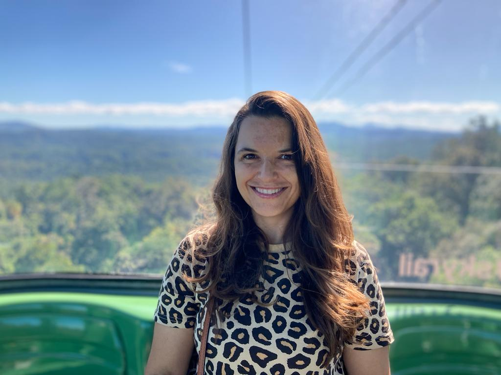

## **Laura Roldan-Gomez**

PhD Candidate

Q-Step Centre, University of Exeter

 

Welcome to my site.

I am a second year PhD student in the [Q-Step Centre](http://socialsciences.exeter.ac.uk/q-step/) at the University of Exeter. I am looking at how armed conflict in Colombia corresponds to changes in deforestation using network analysis methods.
 
My research interests include social-ecological systems and social network analysis.

### 

{width=80%}
</a>

